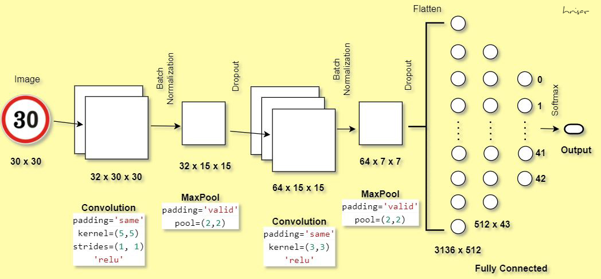
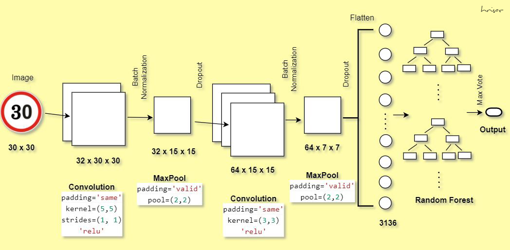

# Traffic Sign Classification

Objective
-

The German Traffic Sign Recognition Benchmark (GTSRB) is a multi-class, single-image classification challenge. It has 43 classes, 50000+ images in total. Our objective is to classify the images into its respective classes.

Structure
-

In the first model we used a convolution neural network followed by a fully connected network.

In the second model we used a convolution neural network followed by random forest.

Result
-

The model with CNN+DNN gave an accuracy of 97.11% on test data, while the model with CNN+RF gave an accuracy of 95.64%.
